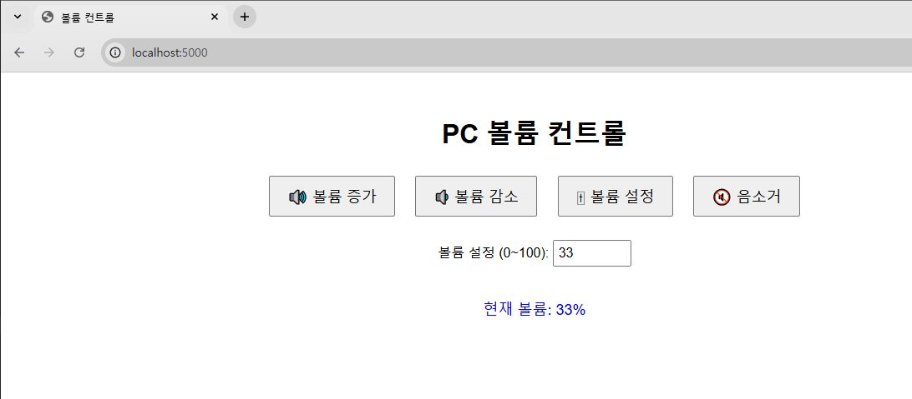

# volume-control-server
A simple Python server to control the volume from an external PC ( tested with Windows )

## Introduce

- I often use controllers other than a keyboard and mouse when playing games. When I'm playing from a distance away from my computer and need to adjust the volume, it's inconvenient to walk over to the PC. Therefore, I developed a feature that allows me to **remotely control my PC's volume by accessing a volume control page hosted on the local PC from my mobile device**.

## How to use

#### Hosting Volume Control Server

1. First, install Python and modules. Modules can be installed with command-line below:
```
pip install Flask pycaw
```

2. Host server with Python:
```
python main.py
```
Server will running on port 5000 and you can now access service with http://localhost:5000 .

#### Locate service with web



Once you locate service, you can use 4 features:
- Volume-Up
- Volume-Down
- Set Volume with specific number between 0 ~ 100
- Mute/Unmute Toggle

You can access the hosted page from other devices (e.g., a phone or another PC) on the same network (e.g., Wi-Fi). In this case, replace <u>localhost</u> with the internal IP address of the hosting server PC.

## Notice

- This service has been tested on a server hosted on Windows, so it may not function properly on macOS or Linux-based machines.